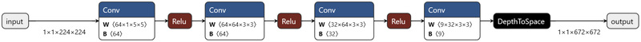
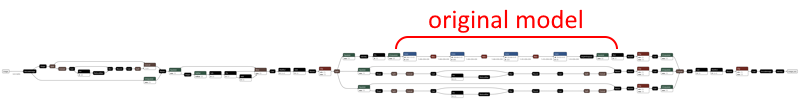

# **Built-in model pre-processing with ONNX**

## **Add pre-processing to the model**

Instead of having to write the input image resizing and other manipulations in Kotlin, the pre- and post-processing steps can be added to the model using operators available in newer versions of the ONNX runtime (eg. ORT 1.14/opset 18) or in the `onnxruntime_extensions` library.

My analyzer is a great demonstration of this feature as both the input and output are images, so including the processing steps in the model greatly reduces platform-specific code.

The steps to add the pre- and post-processing to the model are in the [Prepare the model](https://onnxruntime.ai/docs/tutorials/mobile/superres.html#prepare-the-model) section of the sample documentation. The python script that creates the updated model can be viewed at [yolo_e2e.py](../../prepostprocessor/yolo_e2e.py).

> ---
> The **yolo_e2e** script is explained step-by-step below :
> - Load target model in `*.onnx` from local machine.
> - Set suffix to output file name to **.with_pre_post_processing.onnx**.
> - Adding pre- and post-processing to original model by calling `add_pre_post_processing_to_yolo`:
>   - Preparing I/O of the graph.
>   - Creating `PrePostProcessor` pipeline.
>     - Set pre-processor:
>       - Convert the image into BGR color type.
>       - Resize the image to target size based on input of your model with `not_larger` policy while keeping the original aspect ratio.
>       - Make `LetterBox` by :
>         - crop the image, If target_shape is less than the original image
>         - add padding, If target_shape is great than the original image
>       - Set image channel (`HWC` to `CHW`).
>       - Convert byte image to float in range 0..1.
>       - Unsqueeze it (add batch, `CHW` --> `1CHW`).
>     - Set post-processor:
>       - Squeeze it to remove batch dimension.
>       - Separate bounding box and confidence outputs.
>       - Apply NMS to suppress bounding boxes.
>       - Scale bounding box coords back to original image.
>       - Added debugger to access "scaled_box_out", it's the output from "ScaleBoundingBoxes" or boxes.
>       - Draw bounding boxes to original image.
>       - Convert `BGR` to image.
>   - Apply `PrePostProcessor` to original model.
>   - Save new model.
> - Test the new model, the result is in [prepostprocessor/test/data/result.jpg](../../prepostprocessor/test/data/result.jpg).
>
> ---

When you run the script as instructed, it produces two models in ONNX format – the basic **yolov8n.onnx** model and another version that includes additional processing **yolov8n.with_pre_post_processing.onnx**. The second model, including the processing instructions, can be called in an Android app with fewer lines of code.

## **Usage**

> The `PrePostProcessor` this repository, I refer to [yolo_e2e.py](https://github.com/microsoft/onnxruntime-extensions/blob/main/tutorials/yolo_e2e.py) from microsoft.

Firstly, you should convert your **YOLO** model from `*.pt` to `*.onnx` file format by using [`ultralytics`'s CLI](https://docs.ultralytics.com/usage/cli/#export), example `yolov8n` :

```sh
yolo export format=onnx imgsz=640 optimize=True int8=True simplify=True model="path\to\your\model\yolov8n.pt"
```

In case you have already had the model in `*.onnx` file format. Please move the model into `prepostprocessor/test/data/`.

Then install dependencies :

```sh
pip install -r requirements.txt
pip install --index-url https://aiinfra.pkgs.visualstudio.com/PublicPackages/_packaging/ORT-Nightly/pypi/simple/ onnxruntime-extensions
```

After that run :

```sh
python yolo_e2e.py
```

The output file of this process is `prepostprocessor/test/data/yolov8n.with_pre_post_processing.onnx`.

***Example output***

Original NN:



Pre-processing NN:

You will see `DecodeImage` node before original NN.



## **References**

- [Add pre-processing to the model](https://devblogs.microsoft.com/surface-duo/onnx-machine-learning-4/).
